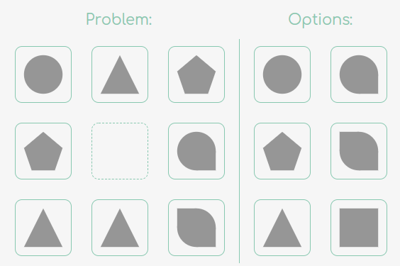

Магический квадрат - это квадрат, у которого сумма всех
чисел по столбцу, строке и диагонали равна.

Полу-магический квадрат - это магический квадрат, у которого
не соблюдается правило для диагоналей.

