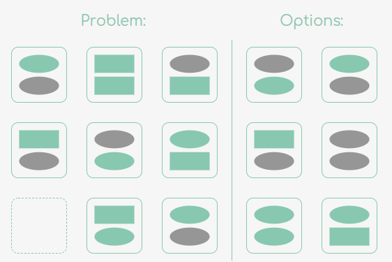

Задача является усложненной версией задачи [О двух фигурах](/#/Server/Генерация%20задач/Задача%20двух%20фигур%20%28Легкая%20сложность%29)

Однако в этой версии имеется три типа фигур и каждая должна встречаться
на своем месте только один раз.

